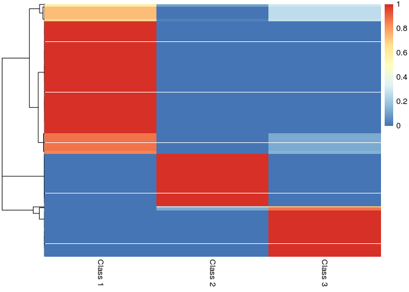
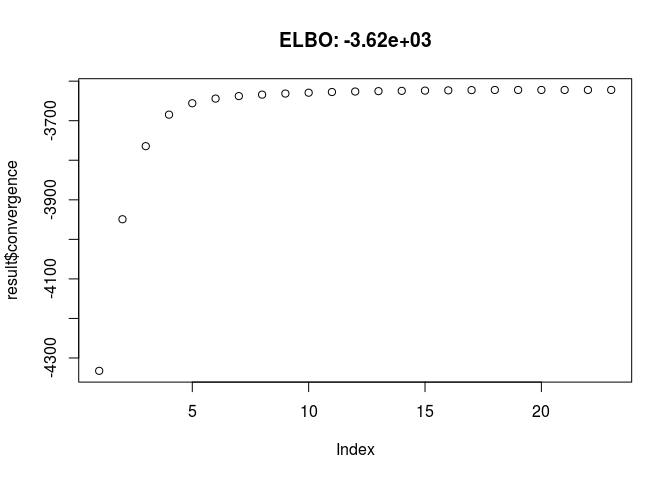
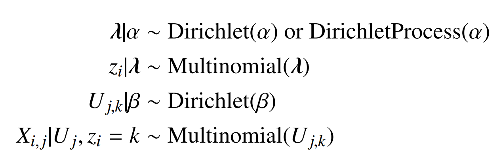
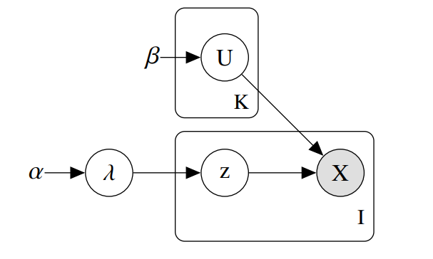

<!-- README.md is generated from README.Rmd. Please edit that file -->
mixdir
======

The goal of mixdir is to cluster high dimensional categorical datasets.

It can

-   handle missing data
-   infer a reasonable number of latent class (try `mixdir(select_latent=TRUE)`)
-   cluster datasets with more than 70,000 observations and 60 features
-   propagate uncertainty and produce a soft clustering

Installation
------------

``` r
devtools::install_github("const-ae/mixdir")
```

Example
-------

Clustering the [mushroom](https://archive.ics.uci.edu/ml/datasets/mushroom) data set.

``` r
# Loading the library and the data
library(mixdir)
set.seed(1)

data("mushroom")
# High dimensional dataset: 8124 mushroom and 23 different features
mushroom[1:10, 1:5]
#>    bruises cap-color cap-shape cap-surface    edible
#> 1  bruises     brown    convex      smooth poisonous
#> 2  bruises    yellow    convex      smooth    edible
#> 3  bruises     white      bell      smooth    edible
#> 4  bruises     white    convex       scaly poisonous
#> 5       no      gray    convex      smooth    edible
#> 6  bruises    yellow    convex       scaly    edible
#> 7  bruises     white      bell      smooth    edible
#> 8  bruises     white      bell       scaly    edible
#> 9  bruises     white    convex       scaly poisonous
#> 10 bruises    yellow      bell      smooth    edible
```

Calling the clustering function `mixdir` on a subset of the data:

``` r
# Clustering into 3 latent classes
result <- mixdir(mushroom[1:1000, 1:5], n_latent=3)
```

Analyzing the result

``` r
# Latent class of of first 10 mushrooms
head(result$pred_class, n=10)
#>  [1] 3 1 1 3 2 1 1 1 3 1

# Soft Clustering for first 10 mushrooms
head(result$class_prob, n=10)
#>               [,1]         [,2]         [,3]
#>  [1,] 2.781141e-14 2.915757e-09 1.000000e+00
#>  [2,] 1.000000e+00 1.286473e-09 4.022864e-08
#>  [3,] 1.000000e+00 8.483274e-10 3.020595e-08
#>  [4,] 1.734041e-07 1.173963e-11 9.999998e-01
#>  [5,] 4.078317e-14 1.000000e+00 4.873989e-14
#>  [6,] 9.999999e-01 1.450405e-11 1.053419e-07
#>  [7,] 1.000000e+00 8.483274e-10 3.020595e-08
#>  [8,] 9.999999e-01 9.564273e-12 7.909668e-08
#>  [9,] 1.734041e-07 1.173963e-11 9.999998e-01
#> [10,] 1.000000e+00 4.799899e-16 8.694462e-15
pheatmap::pheatmap(result$class_prob, cluster_cols=FALSE,
                  labels_col = paste("Class", 1:3))
```



``` r

# Structure of latent class 1
# (bruises, cap color either yellow or white, edible etc.)
purrr::map(result$category_prob, 1)
#> $bruises
#>      bruises           no 
#> 0.9996447887 0.0003552113 
#> 
#> $`cap-color`
#>        brown         gray          red        white       yellow 
#> 0.0003548468 0.0003592167 0.0003548906 0.4077977750 0.5911332709 
#> 
#> $`cap-shape`
#>         bell       convex         flat       sunken 
#> 0.3925723193 0.4765681327 0.1305046002 0.0003549479 
#> 
#> $`cap-surface`
#>    fibrous      scaly     smooth 
#> 0.05700435 0.48705770 0.45593795 
#> 
#> $edible
#>       edible    poisonous 
#> 0.9996447805 0.0003552195

# The most predicitive features for each class
find_predictive_features(result$lambda, result$category_prob, top_n=3)
#>       column    answer class probability
#> 19 cap-color    yellow     1   0.9988010
#> 22 cap-shape      bell     1   0.9981940
#> 1    bruises   bruises     1   0.7089829
#> 48    edible poisonous     3   0.9961025
#> 15 cap-color       red     3   0.7498975
#> 9  cap-color     brown     3   0.6468097
#> 5    bruises        no     2   0.9980757
#> 11 cap-color      gray     2   0.9957144
#> 32 cap-shape    sunken     2   0.9873503
# For example: if all I know about a mushroom is that it has a
# yellow cap, then I am 99% certain that it will be in class 1
predict_class(c(`cap-color`="yellow"), result$lambda, result$category_prob)
#> [1] 0.9988009540 0.0005996516 0.0005993944

# Convergence
plot(result$convergence, main=paste0("ELBO: ", formatC(result$ELBO, digits = 3)))
```



Underlying Model
================

The package implements a variational inference algorithm to solve a Bayesian latent class model (LCM).





------------------------------------------------------------------------

Disclaimer
==========

This package is still under development and can still change profoundly.
