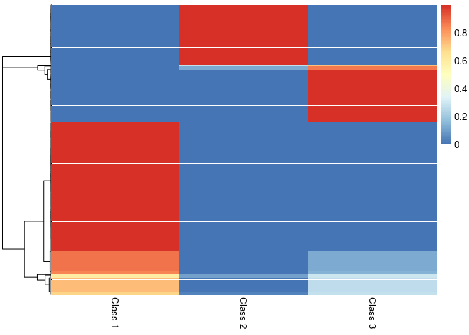

<!-- README.md is generated from README.Rmd. Please edit that file -->
mixdir
======

The goal of mixdir is to cluster high dimensional categorical datasets.

It can

-   handle missing data
-   infer a reasonable number of latent class (try `mixdir(select_latent=TRUE)`)
-   cluster datasets with more than 70,000 observations and 60 features
-   propagate uncertainty and produce a soft clustering

A detailed description of the algorithm and the features of the package can be found in the the accompanying [paper](http://ieeexplore.ieee.org/stamp/stamp.jsp?tp=&arnumber=8631438&isnumber=8631391). If you find the package useful please cite

> C. Ahlmann-Eltze and C. Yau, "MixDir: Scalable Bayesian Clustering for High-Dimensional Categorical Data", 2018 IEEE 5th International Conference on Data Science and Advanced Analytics (DSAA), Turin, Italy, 2018, pp. 526-539.

Installation
------------

``` r
install.packages("mixdir")

# Or to get the latest version from github
devtools::install_github("const-ae/mixdir")
```

Example
-------

Clustering the [mushroom](https://archive.ics.uci.edu/ml/datasets/mushroom) data set.


``` r
# Loading the library and the data
library(mixdir)
set.seed(1)

data("mushroom")
# High dimensional dataset: 8124 mushroom and 23 different features
mushroom[1:10, 1:5]
#>    bruises cap-color cap-shape cap-surface    edible
#> 1  bruises     brown    convex      smooth poisonous
#> 2  bruises    yellow    convex      smooth    edible
#> 3  bruises     white      bell      smooth    edible
#> 4  bruises     white    convex       scaly poisonous
#> 5       no      gray    convex      smooth    edible
#> 6  bruises    yellow    convex       scaly    edible
#> 7  bruises     white      bell      smooth    edible
#> 8  bruises     white      bell       scaly    edible
#> 9  bruises     white    convex       scaly poisonous
#> 10 bruises    yellow      bell      smooth    edible
```

Calling the clustering function `mixdir` on a subset of the data:

``` r
# Clustering into 3 latent classes
result <- mixdir(mushroom[1:1000,  1:5], n_latent=3)
```

Analyzing the result

``` r
# Latent class of of first 10 mushrooms
head(result$pred_class, n=10)
#>  [1] 3 1 1 3 2 1 1 1 3 1

# Soft Clustering for first 10 mushrooms
head(result$class_prob, n=10)
#>               [,1]         [,2]         [,3]
#>  [1,] 3.103495e-07 1.055098e-05 9.999891e-01
#>  [2,] 9.998594e-01 4.683764e-06 1.359291e-04
#>  [3,] 9.998944e-01 3.111462e-06 1.025194e-04
#>  [4,] 5.778033e-04 7.114603e-08 9.994221e-01
#>  [5,] 3.662625e-07 9.999992e-01 4.183025e-07
#>  [6,] 9.996461e-01 8.764031e-08 3.537838e-04
#>  [7,] 9.998944e-01 3.111462e-06 1.025194e-04
#>  [8,] 9.997331e-01 5.822320e-08 2.668420e-04
#>  [9,] 5.778033e-04 7.114603e-08 9.994221e-01
#> [10,] 9.999999e-01 5.850067e-09 9.845112e-08
pheatmap::pheatmap(result$class_prob, cluster_cols=FALSE,
                  labels_col = paste("Class", 1:3))
```



``` r

# Structure of latent class 1
# (bruises, cap color either yellow or white, edible etc.)
purrr::map(result$category_prob, 1)
#> $bruises
#>      bruises           no 
#> 0.9998223256 0.0001776744 
#> 
#> $`cap-color`
#>        brown         gray          red        white       yellow 
#> 0.0001775934 0.0001819672 0.0001776373 0.4079822666 0.5914805356 
#> 
#> $`cap-shape`
#>      bell    convex      flat    sunken 
#> 0.3926736 0.4767291 0.1304197 0.0001776 
#> 
#> $`cap-surface`
#>   fibrous     scaly    smooth 
#> 0.0568571 0.4871396 0.4560033 
#> 
#> $edible
#>       edible    poisonous 
#> 0.9998223174 0.0001776826

# The most predicitive features for each class
find_predictive_features(result, top_n=3)
#>       column    answer class probability
#> 19 cap-color    yellow     1   0.9993990
#> 22 cap-shape      bell     1   0.9990947
#> 1    bruises   bruises     1   0.7089533
#> 48    edible poisonous     3   0.9980468
#> 15 cap-color       red     3   0.8462032
#> 9  cap-color     brown     3   0.6473043
#> 5    bruises        no     2   0.9990364
#> 11 cap-color      gray     2   0.9978218
#> 32 cap-shape    sunken     2   0.9936162
# For example: if all I know about a mushroom is that it has a
# yellow cap, then I am 99% certain that it will be in class 1
predict(result, c(`cap-color`="yellow"))
#>          [,1]         [,2]         [,3]
#> [1,] 0.999399 0.0003004692 0.0003004907

# Note the most predictive features are different from the most typical ones
find_typical_features(result, top_n=3)
#>         column  answer class probability
#> 1      bruises bruises     1   0.9998223
#> 43      edible  edible     1   0.9998223
#> 19   cap-color  yellow     1   0.5914805
#> 3      bruises bruises     3   0.9995546
#> 27   cap-shape  convex     3   0.7460615
#> 9    cap-color   brown     3   0.6746224
#> 44      edible  edible     2   0.9995310
#> 5      bruises      no     2   0.9713177
#> 35 cap-surface fibrous     2   0.7355413
```

Dimensionality Reduction

``` r
# Defining Features
def_feat <- find_defining_features(result, mushroom[1:1000,  1:5], n_features = 3)
print(def_feat)
#> $features
#> [1] "cap-color" "bruises"   "edible"   
#> 
#> $quality
#> [1] 74.35146

# Plotting the most important features gives an immediate impression
# how the cluster differ
plot_features(def_feat$features, result$category_prob)
#> Loading required namespace: ggplot2
#> Loading required namespace: tidyr
```


Underlying Model
================

The package implements a variational inference algorithm to solve a Bayesian latent class model (LCM).


